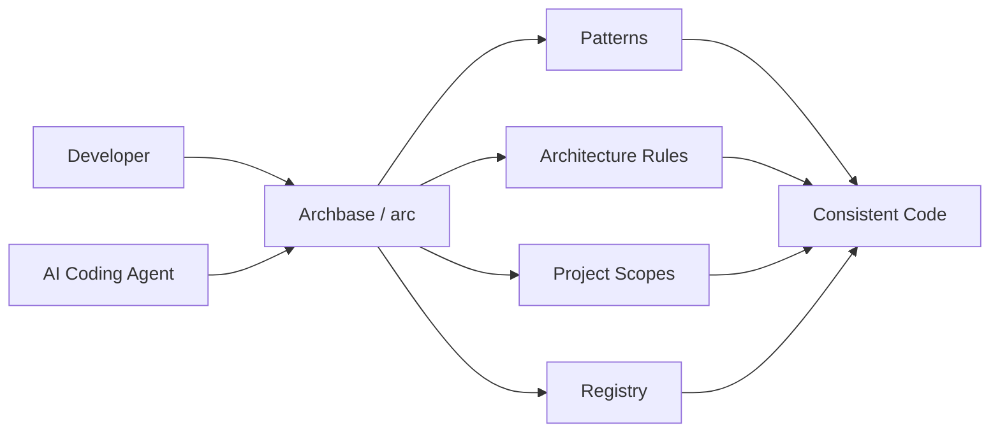
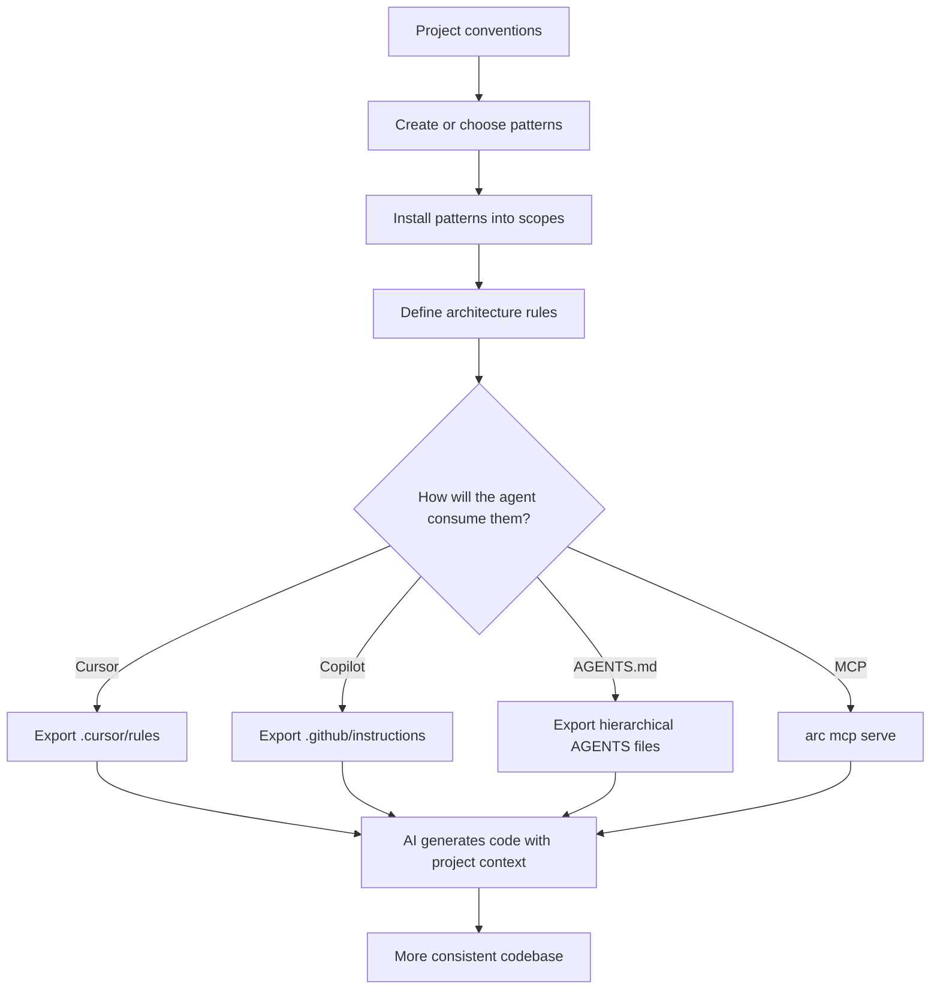

# Archbase

<p align="center">
  <strong>Architecture that AI coding agents can actually follow.</strong>
</p>

<p align="center">
  Open-source CLI in Go for reusable code patterns, architecture rules, local scopes and AI-agent integrations.
</p>

<p align="center">
  
  
  
  
  
  
</p>

---

## What is Archbase?

**Archbase** is an open-source CLI designed to make software architecture explicit, reusable and understandable by both developers and AI coding agents.

Instead of relying only on prompts such as _"follow the project pattern"_ or _"create this file like the others"_, Archbase lets a project define concrete structural references that an agent can inspect and reuse.

The core idea is simple:

- **Patterns** define **how a type of code is structured**.
- **Rules** define **where code belongs and which relationships are allowed**.
- **Scopes** define **which pattern applies to a specific part of a project**.
- **Registries** distribute reusable patterns and architecture rules.
- **MCP** exposes that context directly to compatible AI agents.

The goal is not to generate an entire application from a template. The goal is to give developers and coding agents a reliable architectural reference while the project evolves.

---

## Why Archbase?

AI coding tools are very good at generating code, but they often have one recurring problem:

> they understand the task, but not always the exact way your project expects that code to be organized.

A repository may already have conventions for pages, hooks, controllers, repositories, services or utilities, but those conventions are usually implicit.

Archbase turns those conventions into something that can be:

- versioned;
- inspected;
- reused;
- customized locally;
- exported to different coding agents;
- resolved automatically by project path;
- exposed through MCP.



---

## Mental model

### Pattern

A pattern is a structural example for one type of code.

Examples:

```text
astro/page@5904
astro/layout@6813
astro/component@3148
astro/content-collection@4720
astro/util@2386

next/page@1234
next/component@4821
next/hook@9214
next/util@3378

next-feature/page@1846
next-feature/layout@2673
next-feature/route-handler@7318
next-feature/server-action@6492
next-feature/application-service@3527
next-feature/data-access@8164
next-feature/model@4739
next-feature/schema@9251
next-feature/component@5086

dotnet/controller@7743
dotnet/service@1172
dotnet/repository@5532

dotnet-multiproject/bootstrap@1624
dotnet-multiproject/controller@2947
dotnet-multiproject/application-service@5279
dotnet-multiproject/repository@6485
dotnet-multiproject/contracts@4716
dotnet-multiproject/di-composition@7138
dotnet-multiproject/exception-handler@8463
dotnet-multiproject/background-job@8094

nestjs/bootstrap@1437
nestjs/module@6419
nestjs/controller@2864
nestjs/service@4793
nestjs/dto@9175
nestjs/guard@3642
nestjs/http-client@7528
nestjs/http-envelope@5281
nestjs/prisma-service@8356

python/router@2784
python/service@7315
python/repository@8462
python/schemas@3950

spring-boot/bootstrap@1258
spring-boot/controller@2841
spring-boot/service@3714
spring-boot/repository@5427
spring-boot/entity@4172
spring-boot/dto@9365
spring-boot/mapper@6583
spring-boot/security@8196
spring-boot/api-advice@7634

react/page@6325
react/component@5217
react/api-controller@6142
react/api-model@4086
react/hook@8534
react/routes@1973
react/util@3469

react-tailwind/page@6592
react-tailwind/component@5463
react-tailwind/ui-primitive@7924
react-tailwind/api-controller@7251
react-tailwind/api-model@4380
react-tailwind/api-routes@2648
react-tailwind/routes@2159
```

A pattern does **not** describe a business feature. It describes the expected structure of that kind of code.

### Architecture Rule

A rule defines where patterns belong and how the architecture is expected to behave.

Examples included in the current catalog:

```text
architecture/astro-content-site@1
architecture/dotnet-multiproject@1
architecture/nestjs-prisma-modular@1
architecture/next-feature-app-router@1
architecture/next-modular@1
architecture/dotnet-layered@1
architecture/python-fastapi-modular@1
architecture/react-tailwind-modular@1
architecture/react-vite-modular@1
architecture/spring-boot-layered@1
```

A rule can define things such as:

- which pattern belongs under `src/pages/**`;
- which pattern belongs under `src/components/**`;
- Controller → Service → Repository responsibilities;
- forbidden dependency directions;
- architectural restrictions for a specific scope.

### Scope

Archbase stores project-level configuration inside `.archbase`.

A project can have multiple nested scopes.

```text
project/
├── .archbase/
│   └── scope.yaml
│
└── src/
    └── pages/
        └── admin/
            └── .archbase/
                └── scope.yaml
```

When Archbase resolves a file, the **nearest valid scope wins**.

This makes it possible to use one global project convention while keeping more specialized conventions in specific directories.

---

## Main CLI

The executable is called:

```bash
arc
```

Main commands currently available:

```bash
arc help
arc version

arc add <pattern-id> <scope>
arc create <local-name> <scope> --from <pattern-id>

arc resolve <path>
arc inspect <pattern-id-or-path>

arc rules list
arc rules inspect <rule-id>
arc rules add <rule-id> --format cursor|copilot|agents

arc mcp serve --project-root .
```

---

## Quick start

### 1. Install Archbase

Download the archive for your operating system from the GitHub Releases page.

The project publishes builds for Linux, macOS and Windows with SHA-256 checksums.

After extracting the binary, place `arc` or `arc.exe` somewhere available in your `PATH`.

Check the installation:

```bash
arc version
```

### 2. Add a pattern to a project

Example using the Next.js page pattern:

```bash
arc add next/page@1234 .
```

Archbase creates a local `.archbase` scope and stores the validated pattern bundle.

You can then resolve a file even if that file does not exist yet:

```bash
arc resolve src/pages/Home.tsx
```

### 3. Inspect the pattern

```bash
arc inspect next/page@1234
```

This allows developers and agents to inspect the canonical structure before generating new code.

---

## Create your own customized pattern

You are not limited to the official registry.

A local pattern can be created from an existing pattern:

```bash
arc create pages-standard ./src/pages --from next/page@1234
```

This creates a project-owned pattern such as:

```text
local/pages-standard@1
```

Its files can then be customized directly inside the local `.archbase` directory.

Archbase preserves that local customization instead of replacing it with future registry content.

Example:

```text
src/pages/
└── .archbase/
    ├── scope.yaml
    └── patterns/
        └── pages-standard/
            └── Example/
                ├── Example.tsx
                ├── Example.hook.ts
                └── Example.utils.ts
```

This makes Archbase useful not only as a public pattern registry, but also as a way to encode the conventions of a specific team or codebase.

---

## Architecture rules for coding agents

Archbase rules are agent-neutral.

The same canonical architecture rule can be exported for different tools.

### Cursor

```bash
arc rules add architecture/next-modular@1 --format cursor
```

Generated output:

```text
.cursor/rules/
```

### GitHub Copilot

```bash
arc rules add architecture/next-modular@1 --format copilot
```

Generated output:

```text
.github/instructions/
```

### AGENTS.md

```bash
arc rules add architecture/next-modular@1 --format agents
```

For an existing `AGENTS.md`, use the explicit merge mode:

```bash
arc rules add architecture/next-modular@1 --format agents --merge
```

Archbase manages only its own RuleID-specific block, preserving unrelated content already present in the file.

---

## MCP support

Archbase can also expose project architecture directly through the **Model Context Protocol**.

Start the MCP server with:

```bash
arc mcp serve --project-root .
```

The MCP server is read-only and allows compatible agents to inspect the validated Archbase context.

Available tools include:

```text
search_patterns
get_pattern
resolve_pattern
get_pattern_files
get_scope_rules
list_project_scopes
```

Example MCP configuration:

```json
{
  "mcpServers": {
    "archbase": {
      "command": "arc",
      "args": [
        "mcp",
        "serve",
        "--project-root",
        "/absolute/path/to/project"
      ]
    }
  }
}
```

This gives an AI coding agent access to the project's actual patterns and architecture rules instead of requiring those conventions to be repeated manually in every prompt.

---

## Registry

The official catalog is embedded in the `arc` binary, so the built-in patterns can work offline.

Archbase can also use a public Git registry.

A configured Git registry can be given precedence over the embedded catalog using the global registry options:

```text
--registry-url
--registry-ref
--registry-subdir
--registry-cache-dir
--registry-ttl
```

The registry layer includes:

- ordered source resolution;
- bundle validation;
- path confinement;
- concurrency-safe cache;
- default cache TTL;
- validated stale-cache fallback;
- support for public Git and local file registries.

---

## Current official catalog

### Astro

| Type | Pattern ID |
| --- | --- |
| Page | `astro/page@5904` |
| Layout | `astro/layout@6813` |
| Component | `astro/component@3148` |
| Content collection | `astro/content-collection@4720` |
| Utility | `astro/util@2386` |

### Next.js

| Type | Pattern ID |
| --- | --- |
| Page | `next/page@1234` |
| Component | `next/component@4821` |
| Hook | `next/hook@9214` |
| Utility | `next/util@3378` |

### Next.js App Router / feature-first

| Type | Pattern ID |
| --- | --- |
| Page | `next-feature/page@1846` |
| Layout | `next-feature/layout@2673` |
| Route Handler | `next-feature/route-handler@7318` |
| Server Action | `next-feature/server-action@6492` |
| Application service | `next-feature/application-service@3527` |
| Data access | `next-feature/data-access@8164` |
| Model | `next-feature/model@4739` |
| Schema | `next-feature/schema@9251` |
| Server/Client components | `next-feature/component@5086` |

### .NET

| Type | Pattern ID |
| --- | --- |
| Controller | `dotnet/controller@7743` |
| Service | `dotnet/service@1172` |
| Repository | `dotnet/repository@5532` |

### .NET multi-project

| Type | Pattern ID |
| --- | --- |
| API bootstrap | `dotnet-multiproject/bootstrap@1624` |
| Controller | `dotnet-multiproject/controller@2947` |
| Application service | `dotnet-multiproject/application-service@5279` |
| Repository | `dotnet-multiproject/repository@6485` |
| Shared contracts | `dotnet-multiproject/contracts@4716` |
| Dependency composition | `dotnet-multiproject/di-composition@7138` |
| Exception handler | `dotnet-multiproject/exception-handler@8463` |
| Background job | `dotnet-multiproject/background-job@8094` |

### NestJS / Prisma

| Type | Pattern ID |
| --- | --- |
| Bootstrap | `nestjs/bootstrap@1437` |
| Feature module | `nestjs/module@6419` |
| Controller | `nestjs/controller@2864` |
| Application service | `nestjs/service@4793` |
| Validated DTO | `nestjs/dto@9175` |
| Authentication guard | `nestjs/guard@3642` |
| External HTTP client | `nestjs/http-client@7528` |
| HTTP response envelope | `nestjs/http-envelope@5281` |
| Prisma infrastructure | `nestjs/prisma-service@8356` |

### Python / FastAPI

| Type | Pattern ID |
| --- | --- |
| Router | `python/router@2784` |
| Schemas | `python/schemas@3950` |
| Service | `python/service@7315` |
| Repository | `python/repository@8462` |

### Java / Spring Boot

| Type | Pattern ID |
| --- | --- |
| Application bootstrap | `spring-boot/bootstrap@1258` |
| REST controller | `spring-boot/controller@2841` |
| Transactional service | `spring-boot/service@3714` |
| JPA repository | `spring-boot/repository@5427` |
| Audited entity | `spring-boot/entity@4172` |
| Validated DTO | `spring-boot/dto@9365` |
| MapStruct mapper | `spring-boot/mapper@6583` |
| JWT security | `spring-boot/security@8196` |
| Response and exception advice | `spring-boot/api-advice@7634` |

### React / Vite

| Type | Pattern ID |
| --- | --- |
| Page | `react/page@6325` |
| Component | `react/component@5217` |
| API controller | `react/api-controller@6142` |
| API model | `react/api-model@4086` |
| Shared hook | `react/hook@8534` |
| Routes | `react/routes@1973` |
| Utility | `react/util@3469` |

### React / Tailwind

| Type | Pattern ID |
| --- | --- |
| Page | `react-tailwind/page@6592` |
| Domain component | `react-tailwind/component@5463` |
| UI primitive | `react-tailwind/ui-primitive@7924` |
| API controller | `react-tailwind/api-controller@7251` |
| API model | `react-tailwind/api-model@4380` |
| API routes | `react-tailwind/api-routes@2648` |
| Routes and page registry | `react-tailwind/routes@2159` |

### Architecture rules

| Architecture | Rule ID |
| --- | --- |
| Astro content site | `architecture/astro-content-site@1` |
| Multi-project ASP.NET Core | `architecture/dotnet-multiproject@1` |
| Modular NestJS/Prisma API | `architecture/nestjs-prisma-modular@1` |
| Feature-oriented Next.js App Router | `architecture/next-feature-app-router@1` |
| Modular Next.js | `architecture/next-modular@1` |
| Layered .NET | `architecture/dotnet-layered@1` |
| Modular FastAPI | `architecture/python-fastapi-modular@1` |
| Modular React/Tailwind | `architecture/react-tailwind-modular@1` |
| Modular React/Vite | `architecture/react-vite-modular@1` |
| Layered Spring Boot | `architecture/spring-boot-layered@1` |

The catalog is intentionally small in the first public version. New languages, stacks and architecture styles can be added incrementally.

---

## How Archbase fits into a development workflow



---

## Build from source

### Requirements

```text
Go 1.26+
```

Clone the repository:

```bash
git clone https://github.com/EnzoCaetano015/Archbase.git
cd Archbase
```

Run the test suite:

```bash
go test ./...
```

Run static validation:

```bash
go vet ./...
```

Build the CLI:

```bash
go build -trimpath ./cmd/arc
```

Run the local binary:

```bash
./arc help
```

On Windows:

```powershell
.\arc.exe help
```

---

## Release build

A release version can be injected during build:

```bash
go build \
  -ldflags "-X github.com/EnzoCaetano015/Archbase/internal/version.Value=0.1.0" \
  ./cmd/arc
```

Stable releases use semantic tags:

```text
vMAJOR.MINOR.PATCH
```

The release pipeline verifies tests, target archives, checksums, reproducibility and embedded CLI version before publication.

---

## Documentation

The repository contains additional technical documentation:

```text
docs/
├── installation.md
├── getting-started.md
├── schemas.md
├── registry.md
├── rules.md
└── mcp.md
```

Recommended starting points:

- `docs/installation.md` — installation on supported operating systems.
- `docs/getting-started.md` — complete first workflow.
- `docs/registry.md` — registry resolution and cache behavior.
- `docs/rules.md` — canonical architecture-rule model.
- `docs/mcp.md` — MCP server and tool contracts.

---

## Open-source roadmap

Archbase is intended to grow through practical architecture patterns rather than becoming a generic code-template dump.

Useful contribution areas include:

- new language patterns;
- new framework patterns;
- architecture rules;
- new agent exporters;
- improvements to the MCP integration;
- registry tooling;
- developer experience;
- documentation;
- tests;
- Windows, Linux and macOS compatibility.

Examples of future catalogs could include:

```text
react/
python/
fastapi/
laravel/
flutter/
spring/
nestjs/
```

The important rule is that a contribution should represent a reusable **structural convention**, not a one-off business feature.

---

## Contributing

Contributions are welcome.

A typical contribution flow is:

```bash
git clone https://github.com/EnzoCaetano015/Archbase.git
cd Archbase
git checkout -b feature/my-contribution
```

Make the change and validate it:

```bash
go test ./...
go vet ./...
go build -trimpath ./cmd/arc
```

Then open a Pull Request describing:

- the problem being solved;
- the proposed behavior;
- why the change belongs in Archbase;
- tests added or updated;
- documentation changes, when applicable.

For changes to public YAML contracts, keep the schema, tests and documentation synchronized.

For new registry entries, preserve deterministic ordering and ensure every declared file passes bundle validation.

---

## Philosophy

Archbase is built around a few principles:

```text
Architecture should be explicit.
Patterns should be reusable.
Local conventions should remain customizable.
AI agents should inspect context instead of guessing it.
Generated instructions should come from one canonical source.
Existing project files should be treated safely.
```

The goal is not to remove developer decisions.

The goal is to make those decisions easier to communicate — to humans and to coding agents.

---

## Project status

The first public milestone is complete and includes:

- `arc` CLI;
- pattern registry;
- architecture-rule registry;
- local scopes;
- local pattern customization;
- Next.js patterns;
- .NET patterns;
- Cursor exporter;
- GitHub Copilot exporter;
- `AGENTS.md` exporter;
- MCP stdio server;
- cross-platform release archives.

Current public version referenced by the documentation:

```text
v0.1.0
```

---

## Author

Created and maintained by **Enzo Caetano**.

GitHub: [@EnzoCaetano015](https://github.com/EnzoCaetano015)

---

<p align="center">
  <strong>Define the architecture once. Let humans and agents follow it.</strong>
</p>
