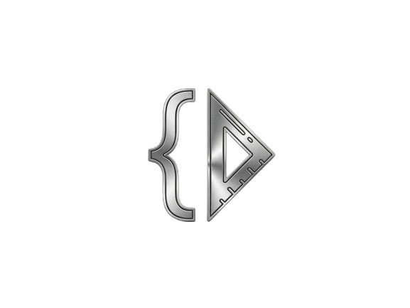

<p align="center">
  
</p>

<h1 align="center">Archbase</h1>

<p align="center">
  <strong>Architecture that AI coding agents can actually follow.</strong>
</p>

<p align="center">
  Open-source CLI in Go for reusable code patterns, architecture rules, local scopes and AI-agent integrations.
</p>

<p align="center">
  
  
  
  
</p>

---

## What is Archbase?

**Archbase** is an open-source CLI designed to make software architecture explicit, reusable and understandable by both developers and AI coding agents.

Instead of relying only on prompts such as _"follow the project pattern"_ or _"create this file like the others"_, Archbase lets a project define concrete structural references that an agent can inspect and reuse.

The core idea is simple:

- **Patterns** define **how a type of code is structured**.
- **Rules** define **where code belongs and which relationships are allowed**.
- **Scopes** define **which pattern applies to a specific part of a project**.
- **Registries** distribute reusable patterns and architecture rules.
- **MCP** exposes that context directly to compatible AI agents.

The goal is not to generate an entire application from a template. The goal is to give developers and coding agents a reliable architectural reference while the project evolves.

---

### Pattern

A pattern is a structural example for one type of code.

Examples:

```text
next-feature/page@1846
next-feature/layout@2673
next-feature/route-handler@7318
next-feature/server-action@6492
next-feature/application-service@3527
next-feature/component@5086

dotnet-multiproject/bootstrap@1624
dotnet-multiproject/controller@2947
dotnet-multiproject/application-service@5279
dotnet-multiproject/repository@6485
dotnet-multiproject/contracts@4716
dotnet-multiproject/di-composition@7138
dotnet-multiproject/exception-handler@8463
dotnet-multiproject/background-job@8094

python/router@2784
python/service@7315
python/repository@8462
python/schemas@3950

spring-boot/bootstrap@1258
spring-boot/controller@2841
spring-boot/service@3714
spring-boot/repository@5427
spring-boot/entity@4172
spring-boot/dto@9365
spring-boot/mapper@6583
spring-boot/security@8196
spring-boot/api-advice@7634

react/page@6325
react/component@5217
react/api-controller@6142
react/api-model@4086
react/hook@8534
react/routes@1973
react/util@3469
```

A pattern does **not** describe a business feature. It describes the expected structure of that kind of code.

### Architecture Rule

A rule defines where patterns belong and how the architecture is expected to behave.

Examples included in the current catalog:

```text
architecture/dotnet-multiproject@1
architecture/next-feature-app-router@1
architecture/dotnet-layered@1
architecture/python-fastapi-modular@1
architecture/spring-boot-layered@1
```

A rule can define things such as:

- which pattern belongs under `src/pages/**`;
- which pattern belongs under `src/components/**`;
- Controller → Service → Repository responsibilities;
- forbidden dependency directions;
- architectural restrictions for a specific scope.

### Scope

Archbase stores project-level configuration inside `.archbase`.

A project can have multiple nested scopes.

```text
project/
├── .archbase/
│   └── scope.yaml
│
└── src/
    └── pages/
        └── admin/
            └── .archbase/
                └── scope.yaml
```

When Archbase resolves a file, the **nearest valid scope wins**.

This makes it possible to use one global project convention while keeping more specialized conventions in specific directories.

---

## Main CLI

The executable is called:

```bash
arc
```

Main commands currently available:

```bash
arc help
arc version

arc add <pattern-id> <scope>
arc create <local-name> <scope> --from <pattern-id>

arc resolve <path>
arc inspect <pattern-id-or-path>

arc rules list
arc rules inspect <rule-id>
arc rules add <rule-id> --format cursor|copilot|agents

arc mcp serve --project-root .
```

---

## Quick start

### 1. Install Archbase

Linux (official):

```bash
curl -fsSL https://archbase.caetanodev.com/install.sh | sh
```

The official Linux installer detects the architecture, verifies the release checksum, installs the executable to `$HOME/.local/bin`, and configures the user `PATH`. Open a new terminal after installation.

macOS and Windows builds remain available as **unsigned previews**, outside the primary installation path. Review their warnings and installation options in the [installation guide](docs/installation.md).

Check the installation:

```bash
arc version
```

### 2. Add a pattern to a project

Example using the Next.js page pattern:

```bash
arc add next/page@1234 .
```

Archbase creates a local `.archbase` scope and stores the validated pattern bundle.

You can then resolve a file even if that file does not exist yet:

```bash
arc resolve src/pages/Home.tsx
```

### 3. Inspect the pattern

```bash
arc inspect next/page@1234
```

This allows developers and agents to inspect the canonical structure before generating new code.

---

## Create your own customized pattern

You are not limited to the official registry.

A local pattern can be created from an existing pattern:

```bash
arc create pages-standard ./src/pages --from next/page@1234
```

This creates a project-owned pattern such as:

```text
local/pages-standard@1
```

Its files can then be customized directly inside the local `.archbase` directory.

Archbase preserves that local customization instead of replacing it with future registry content.

Example:

```text
src/pages/
└── .archbase/
    ├── scope.yaml
    └── patterns/
        └── pages-standard/
            └── Example/
                ├── Example.tsx
                ├── Example.hook.ts
                └── Example.utils.ts
```

This makes Archbase useful not only as a public pattern registry, but also as a way to encode the conventions of a specific team or codebase.

---

## Architecture rules for coding agents

Archbase rules are agent-neutral.

The same canonical architecture rule can be exported for different tools.

### Cursor

```bash
arc rules add architecture/next-modular@1 --format cursor
```

Generated output:

```text
.cursor/rules/
```

### GitHub Copilot

```bash
arc rules add architecture/next-modular@1 --format copilot
```

Generated output:

```text
.github/instructions/
```

### AGENTS.md

```bash
arc rules add architecture/next-modular@1 --format agents
```

For an existing `AGENTS.md`, use the explicit merge mode:

```bash
arc rules add architecture/next-modular@1 --format agents --merge
```

Archbase manages only its own RuleID-specific block, preserving unrelated content already present in the file.

---

## MCP support

Archbase can also expose project architecture directly through the **Model Context Protocol**.

Start the MCP server with:

```bash
arc mcp serve --project-root .
```

The MCP server is read-only and allows compatible agents to inspect the validated Archbase context.

Available tools include:

```text
search_patterns
get_pattern
resolve_pattern
get_pattern_files
get_scope_rules
list_project_scopes
```

Example MCP configuration:

```json
{
  "mcpServers": {
    "archbase": {
      "command": "arc",
      "args": [
        "mcp",
        "serve",
        "--project-root",
        "/absolute/path/to/project"
      ]
    }
  }
}
```

This gives an AI coding agent access to the project's actual patterns and architecture rules instead of requiring those conventions to be repeated manually in every prompt.

---

## Registry

The official catalog is embedded in the `arc` binary, so the built-in patterns can work offline.

Archbase can also use a public Git registry.

A configured Git registry can be given precedence over the embedded catalog using the global registry options:

```text
--registry-url
--registry-ref
--registry-subdir
--registry-cache-dir
--registry-ttl
```

The registry layer includes:

- ordered source resolution;
- bundle validation;
- path confinement;
- concurrency-safe cache;
- default cache TTL;
- validated stale-cache fallback;
- support for public Git and local file registries.

## Build from source

### Requirements

```text
Go 1.26+
```

Clone the repository:

```bash
git clone https://github.com/EnzoCaetano015/Archbase.git
cd Archbase
```

Run the test suite:

```bash
go test ./...
```

Run static validation:

```bash
go vet ./...
```

Build the CLI:

```bash
go build -trimpath ./cmd/arc
```

Run the local binary:

```bash
./arc help
```

On Windows:

```powershell
.\arc.exe help
```

---

## Release build

A release version can be injected during build:

```bash
go build \
  -ldflags "-X github.com/EnzoCaetano015/Archbase/internal/version.Value=0.3.0" \
  ./cmd/arc
```

Stable releases use semantic tags:

```text
vMAJOR.MINOR.PATCH
```

To publish a stable release, open **Actions > Release > Run workflow** on GitHub, select the `main` branch and provide:

- `version`: the new semantic version, such as `v0.3.1`;
- `message`: the annotated tag message and introduction to the generated release notes.

The workflow verifies tests, target archives, checksums, reproducibility and embedded CLI version before it creates the annotated tag and publishes the GitHub release. Existing versions are rejected and no tag is created when an earlier verification step fails.

---

## Contributing

Contributions are welcome.

A typical contribution flow is:

```bash
git clone https://github.com/EnzoCaetano015/Archbase.git
cd Archbase
git checkout -b feature/my-contribution
```

Make the change and validate it:

```bash
go test ./...
go vet ./...
go build -trimpath ./cmd/arc
```

Then open a Pull Request describing:

- the problem being solved;
- the proposed behavior;
- why the change belongs in Archbase;
- tests added or updated;
- documentation changes, when applicable.

For changes to public YAML contracts, keep the schema, tests and documentation synchronized.

For new registry entries, preserve deterministic ordering and ensure every declared file passes bundle validation.

---

## Project status

The first public milestone is complete and includes:

- `arc` CLI;
- pattern registry;
- architecture-rule registry;
- local scopes;
- local pattern customization;
- Next.js patterns;
- .NET patterns;
- Cursor exporter;
- GitHub Copilot exporter;
- `AGENTS.md` exporter;
- MCP stdio server;
- cross-platform release archives.

The current stable version is available on the [GitHub Releases page](https://github.com/EnzoCaetano015/Archbase/releases/latest).

Linux is the official distribution channel. macOS and Windows release artifacts are unsigned previews and may be warned about or blocked by platform security controls. The SignPath Foundation application was not approved at the project's current level of public adoption; Archbase may reapply after gaining broader community recognition. The project has no active SignPath certificate or signing integration. See the [installation guide](docs/installation.md) and [code signing policy](docs/code-signing-policy.md) before downloading a preview build.

## License and policies

Archbase is released under the [MIT License](LICENSE). It does not collect telemetry or personal data; details are in the [privacy policy](docs/privacy.md). Safe removal instructions and the exact system changes made by the installers are documented in the [installation guide](docs/installation.md).

---

## Author

Created and maintained by **Enzo Caetano**.

GitHub: [@EnzoCaetano015](https://github.com/EnzoCaetano015)

---

<p align="center">
  <strong>Define the architecture once. Let humans and agents follow it.</strong>
</p>
